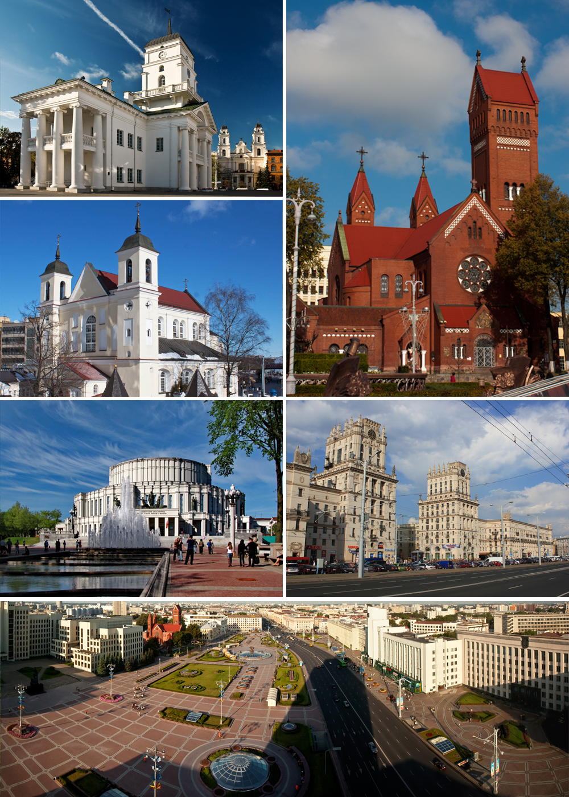
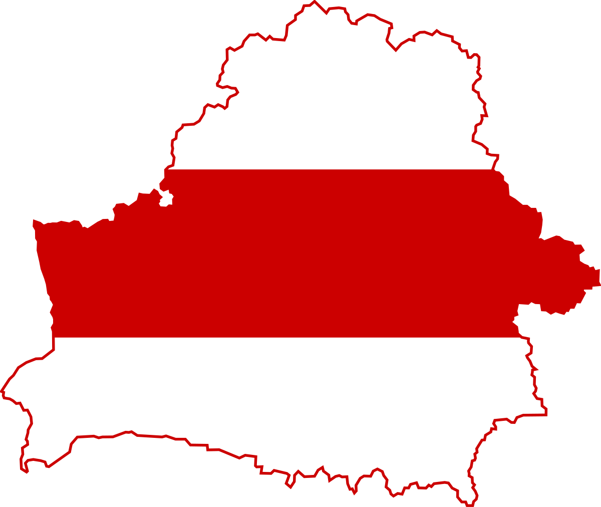

# <a href="https://Vol123.github.io/rsschool-cv">rsschool-cv</a>
---
# <span style="color: dodgerblue; font-style: italic; font-size: 45px;">Haleta Vladimir</span>
---
##  <span style="color: indigo; font-weight: bold; font-size: 35px;">Content</span>
### <span style="color: navy; font-weight: bold; font-size: 30px;">I. Contact Information</span>
* <a href="#name">_Name_</a>
* <a href="#prof">_Profession_</a>
* <a href="#age">_Age_</a>
* <a href="#city">_City_</a>
* <a href="#nat">_Nationality_</a>
* <a href="#phone">_Phone_</a>
* <a href="#email">_E-mail_</a>
* <a href="#telega">_Telegram_</a>
* <a href="#gitHub">_GitHub_</a>
### <span style="color: navy; font-weight: bold; font-size: 30px;">II. History</span> 
* <a href="#history">_History_</a>
* <a href="#code">_My random code on CodeWars_</a>
* <a href="#lang">_Languages_</a>
---
<span id="name" style="color: royalblue">Name: <i style="color: red">Haleta Vladimir</i></span>
<hr>
<span id="prof" style="color: royalblue">Profession: <i style="color: red">Student</i></span>
<hr>
<span id="age" style="color: royalblue">Age: <i style="color: red">15</i></span>
<hr>
<span id="city" style="color: royalblue">City: <i style="color: red">Minsk</i></span>


<hr>
<span id="nat" style="color: royalblue">Nationality: <i style="color: red">Belarus</i></span>


<hr>
<span id="phone" style="color: royalblue">Phone: <i style="color: red">+380997761209</i></span>
<hr>
<span id="email" style="color: royalblue">E-mail: <i style="color: red">vahaleta@gmail.com</i></span>
<hr>
<span id="telega" style="color: royalblue">Telegram: <i style="color: red">@vHaleta</i></span>
<hr>
<span id="gitHub" style="color: royalblue">GitHub: <i style="color: red">Vol123</i></span>
<hr>

# <span id="history" style="color: royalblue; font-size: 30px">History</span>
---
>I used to live in Minsk and there my dad showed me what are C, C++ and I played the piano too.
Then we moved to Kyiv and there I learned what are OOP and C#,
and there he wrote the first desktop application for Windows.
I know a little Python, but only functions, variables, types, arrays - before OOP.
Then the war started and I moved to Warsaw and there I am already learning HTML, CSS, JavaScript, Git...
I began to understand a little what the Internet is. And after two weeks of studying, I already tried to practice.
</div>

---
# <span id="code" style="color: royalblue; font-size: 30px">My random code on CodeWars</span>
<p style="color: red; font-size: 18px">Task: Take a Ten Minutes Walk</p>
<span style="font-size: 20px;">Condition:</span>
<p>You live in the city of Cartesia where all roads are laid out in a perfect grid. You arrived ten minutes too early to an appointment, so you decided to take the opportunity to go for a short walk. The city provides its citizens with a Walk Generating App on their phones -- everytime you press the button it sends you an array of one-letter strings representing directions to walk (eg. ['n', 's', 'w', 'e']). You always walk only a single block for each letter (direction) and you know it takes you one minute to traverse one city block, so create a function that will return true if the walk the app gives you will take you exactly ten minutes (you don't want to be early or late!) and will, of course, return you to your starting point. Return false otherwise.
</p>
<hr>
<span style="font-size: 20px;">Solution:</span>
```
function ReturnNumber(symbol) {
    switch(symbol) {
        case 'n':
            return 1;
        case 's':
            return -1;
        case 'e':
            return 2
        case 'w':
            return -2;
        default:
            return 0;
    }
    return;
}

function isValidWalk(walk) {
    let counts = [];
    if (walk.length === 10) {
        counts.push(ReturnNumber(walk[0]));
        for (let i = 1; i < walk.length; i++) {
            counts.push(ReturnNumber(walk[i]));
            if (counts[counts.length - 1] + counts[counts.length - 2] === 0) 
                counts = counts.splice(0, counts.length - 2);
        }

        if (counts.length === 0)
            return true;
        else
            return false;
    }
    return false;
}
```
---

# <span id="lang" style="color: royalblue; font-size: 30px;">Languages</span>
* Belorussian
* Russian
* Ukrainian
* English (A1)